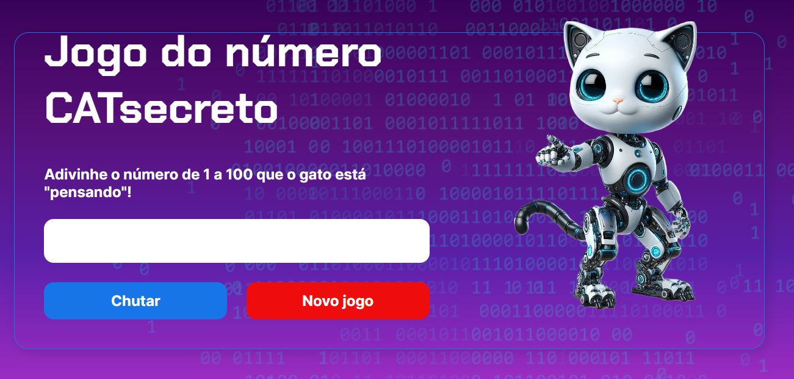

<h1 align="center">Jogo do Número CATsecreto</h1>

  <strong>🎮 Um jogo que desafia sua sorte e lógica, no qual você deve adivinhar o número correto com o menor número de tentativas possível. 🕹️</strong>

  

    <a href="#-visão-do-projeto">Visão do projeto</a> •
    <a href="#-tecnologias">Tecnologias</a> •
    <a href="#-Instruções">Instruções</a> •
    <a href="#-autor">Autor</a>
 

# 🔭 Visão do projeto

O projeto foi desenvolvido com base nos cursos de Lógica de Programação da Alura, como prática dos tópicos abordados durante a formação Iniciante em Programação da Oracle Next Education. A lógica, implementada em JavaScript, desafia os jogadores a adivinharem o número sorteado pelo computador, fornecendo dicas a cada tentativa até que o número correto seja descoberto. Ao final, você poderá ver quantas tentativas foram necessárias para encontrar o número secreto

# 💻 Tecnologias

# ⚙️ Instruções

Você pode acessar/jogar acessando o link do projeto [aqui](https://jogocatsecreto-nugw8sinh-claudio-damascenos-projects.vercel.app/)

- Ao iniciar a página, um pop-up irá parecer abaixo perguntando se deseja narração de voz. Pressione Allow para ativar ou Deny para desativar.
- O número CATsecreto está entre 1 e 100, então escolha um número nessa faixa para acertar o mais rápido possível.

# 🧙‍♂️ Autor
Claudio Damasceno
